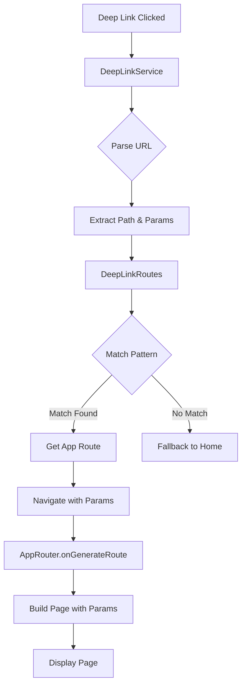

# Deep Linking - Usage Guide

## Overview

Your ME_-_YOU dating app now supports deep linking! Users can open specific pages directly via URLs from external sources like emails, SMS, push notifications, or web browsers.

**Package Used:** `app_links` (modern replacement for the deprecated `uni_links`)

## Supported Deep Link Patterns

### Custom Scheme (Development & Testing)

The app uses the custom scheme `meandyou://` for deep linking:

| Deep Link | Destination | Description |
|-----------|-------------|-------------|
| `meandyou://home` | Home Shell (Tab 0) | Opens home page |
| `meandyou://home/tab/0` | Home Shell (Tab 0) | Opens home tab |
| `meandyou://home/tab/1` | Home Shell (Tab 1) | Opens likes tab |
| `meandyou://home/tab/2` | Home Shell (Tab 2) | Opens chat tab |
| `meandyou://home/tab/3` | Home Shell (Tab 3) | Opens profile tab |
| `meandyou://profile` | Profile Page | Opens your profile |
| `meandyou://profile/123` | Profile Page | Opens profile with user ID 123 |
| `meandyou://chat` | Chat Page | Opens chat page |
| `meandyou://chat/456` | Chat Page | Opens chat with chat ID 456 |
| `meandyou://likes` | Likes Page | Opens likes page |
| `meandyou://login` | Login Page | Opens login page |
| `meandyou://signup` | Sign Up Page | Opens sign up page |

### HTTPS Links (Production)

For production, replace `yourdomain.com` in the platform configuration files with your actual domain:

- `https://yourdomain.com/home`
- `https://yourdomain.com/profile/123`
- `https://yourdomain.com/chat/456`

## Testing Deep Links

### Android Testing

#### Using ADB (Android Debug Bridge)

```bash
# Test home page
adb shell am start -W -a android.intent.action.VIEW -d "meandyou://home"

# Test specific tab (e.g., chat tab - index 2)
adb shell am start -W -a android.intent.action.VIEW -d "meandyou://home/tab/2"

# Test profile with user ID
adb shell am start -W -a android.intent.action.VIEW -d "meandyou://profile/123"

# Test chat with chat ID
adb shell am start -W -a android.intent.action.VIEW -d "meandyou://chat/456"

# Test likes page
adb shell am start -W -a android.intent.action.VIEW -d "meandyou://likes"
```

#### Using Browser

1. Open Chrome on your Android device/emulator
2. Type in the address bar: `meandyou://home`
3. Press Enter
4. The app should open automatically

### iOS Testing

#### Using Simulator

```bash
# Test home page
xcrun simctl openurl booted "meandyou://home"

# Test specific tab (e.g., profile tab - index 3)
xcrun simctl openurl booted "meandyou://home/tab/3"

# Test profile with user ID
xcrun simctl openurl booted "meandyou://profile/123"

# Test chat with chat ID
xcrun simctl openurl booted "meandyou://chat/456"
```

#### Using Safari

1. Open Safari on your iOS device/simulator
2. Type in the address bar: `meandyou://home`
3. Tap "Open" when prompted
4. The app should launch

### Testing from HTML

Create a test HTML file to test deep links:

```html
<!DOCTYPE html>
<html>
<head>
    <title>Deep Link Test</title>
</head>
<body>
    <h1>ME_-_YOU Deep Link Tests</h1>
    
    <h2>Navigation</h2>
    <ul>
        <li><a href="meandyou://home">Home</a></li>
        <li><a href="meandyou://home/tab/1">Likes Tab</a></li>
        <li><a href="meandyou://home/tab/2">Chat Tab</a></li>
        <li><a href="meandyou://home/tab/3">Profile Tab</a></li>
    </ul>
    
    <h2>With Parameters</h2>
    <ul>
        <li><a href="meandyou://profile/user123">Profile (user123)</a></li>
        <li><a href="meandyou://chat/chat456">Chat (chat456)</a></li>
    </ul>
    
    <h2>Auth Pages</h2>
    <ul>
        <li><a href="meandyou://login">Login</a></li>
        <li><a href="meandyou://signup">Sign Up</a></li>
    </ul>
</body>
</html>
```

## Architecture

### Components

#### 1. DeepLinkService
**Location:** `lib/core/services/deep_link_service.dart`

Handles incoming deep links and manages navigation:
- Listens for initial links (cold start)
- Listens for link stream (warm/hot start)
- Parses URLs and extracts parameters
- Navigates to appropriate routes

#### 2. DeepLinkRoutes
**Location:** `lib/core/constants/deep_link_routes.dart`

Defines deep link patterns and parameter extraction:
- Maps URL paths to app routes
- Extracts route parameters (userId, chatId, tabIndex)
- Handles pattern matching

#### 3. AppRouter
**Location:** `lib/core/router/app_router.dart`

Enhanced router with deep linking support:
- `onGenerateRoute()` method for dynamic route generation
- Passes parameters to pages
- Supports all app routes

### Navigation Flow



## Adding New Deep Links

### Step 1: Add Route Pattern

In `lib/core/constants/deep_link_routes.dart`:

```dart
class DeepLinkRoutes {
  // Add new pattern
  static const String newFeature = '/new-feature';
  static const String newFeatureWithId = '/new-feature/:id';
  
  // Add to path mapping
  static Map<String, String> get pathToRoute => {
    // ... existing routes
    newFeature: '/new-feature',
  };
  
  // Add parameter extraction if needed
  static Map<String, String> extractParams(String path) {
    // ... existing extraction logic
    
    // Add new extraction
    final newFeatureRegex = RegExp(r'^/new-feature/([^/]+)$');
    final newFeatureMatch = newFeatureRegex.firstMatch(path);
    if (newFeatureMatch != null) {
      params['featureId'] = newFeatureMatch.group(1)!;
      params['route'] = '/new-feature';
      return params;
    }
    
    return params;
  }
}
```

### Step 2: Add App Route

In `lib/core/constants/app_routes.dart`:

```dart
class AppRoutes {
  // ... existing routes
  static const newFeature = '/new-feature';
}
```

### Step 3: Update Router

In `lib/core/router/app_router.dart`:

```dart
static Route<dynamic>? onGenerateRoute(RouteSettings settings) {
  final args = settings.arguments as Map<String, dynamic>?;

  switch (settings.name) {
    // ... existing cases
    
    case AppRoutes.newFeature:
      return MaterialPageRoute(
        builder: (_) => NewFeaturePage(
          featureId: args?['featureId'] as String?,
        ),
        settings: settings,
      );
      
    // ... rest of cases
  }
}
```

### Step 4: Update Page

Create or update your page to accept parameters:

```dart
class NewFeaturePage extends StatelessWidget {
  final String? featureId;

  const NewFeaturePage({
    super.key,
    this.featureId,
  });

  @override
  Widget build(BuildContext context) {
    // Use featureId in your UI
    return Scaffold(
      body: Text('Feature ID: $featureId'),
    );
  }
}
```

## Production Setup

### Android App Links

1. **Update AndroidManifest.xml** with your domain:
   ```xml
   <data
       android:scheme="https"
       android:host="yourdomain.com" />
   ```

2. **Create assetlinks.json** and host it at:
   `https://yourdomain.com/.well-known/assetlinks.json`

   ```json
   [{
     "relation": ["delegate_permission/common.handle_all_urls"],
     "target": {
       "namespace": "android_app",
       "package_name": "com.yourcompany.meandyou",
       "sha256_cert_fingerprints": ["YOUR_SHA256_FINGERPRINT"]
     }
   }]
   ```

### iOS Universal Links

1. **Update Info.plist** (uncomment the section):
   ```xml
   <key>com.apple.developer.associated-domains</key>
   <array>
       <string>applinks:yourdomain.com</string>
   </array>
   ```

2. **Create apple-app-site-association** and host it at:
   `https://yourdomain.com/.well-known/apple-app-site-association`

   ```json
   {
     "applinks": {
       "apps": [],
       "details": [{
         "appID": "TEAM_ID.com.yourcompany.meandyou",
         "paths": ["*"]
       }]
     }
   }
   ```

## Troubleshooting

### Deep Links Not Working on Android

1. **Check intent filters** in AndroidManifest.xml
2. **Verify scheme** is set to `meandyou`
3. **Test with ADB** to isolate issues
4. **Check logcat** for errors: `adb logcat | grep -i "deep"`

### Deep Links Not Working on iOS

1. **Check URL types** in Info.plist
2. **Verify scheme** is set to `meandyou`
3. **Test with simulator** command
4. **Check console** for errors in Xcode

### Parameters Not Passing

1. **Check DeepLinkRoutes.extractParams()** regex patterns
2. **Verify AppRouter.onGenerateRoute()** is passing arguments
3. **Ensure pages** accept optional parameters in constructor
4. **Add debug prints** in DeepLinkService to trace flow

### Navigation Stack Issues

1. **Use pushNamedAndRemoveUntil** for main routes to clear stack
2. **Use pushNamed** for secondary routes to maintain stack
3. **Check _isMainRoute()** logic in DeepLinkService

### Windows Build Issues

**Error: "Building with plugins requires symlink support"**

**Solution:** Enable Developer Mode in Windows:
```powershell
start ms-settings:developers
```
Then toggle Developer Mode to ON and restart your terminal.

**Error: "Namespace not specified" for uni_links**

**Solution:** Already fixed! The namespace has been added to uni_links build.gradle.

See [WINDOWS_SETUP.md](file:///c:/Users/vignesh.ra/ME_-_YOU/WINDOWS_SETUP.md) for detailed instructions.

## Best Practices

1. **Always test** deep links on both platforms
2. **Handle null parameters** gracefully in pages
3. **Provide fallback** navigation for invalid links
4. **Use descriptive** route names and parameters
5. **Document** all deep link patterns for your team
6. **Test different app states**: cold start, warm start, running
7. **Validate parameters** before using them in UI
8. **Log deep link events** for analytics

## Notes

- The app now uses the modern `app_links` package (v6.4.1+)
- `app_links` is the official replacement for the deprecated `uni_links` package
- Better compatibility with newer Android and iOS versions
- Improved API with Uri objects instead of strings
- Deep links work across all app states (not running, background, foreground)
- No additional configuration needed beyond what's already set up
